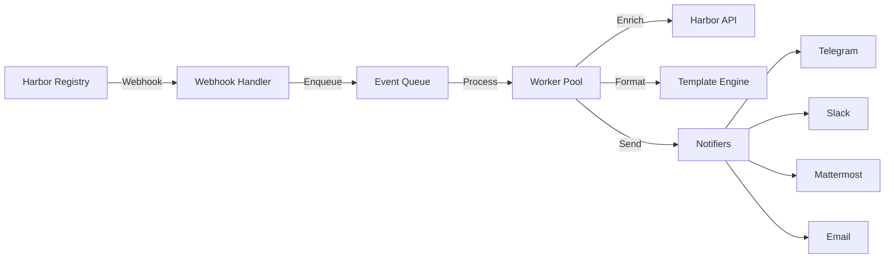

# Architecture

`ht-notifier` is designed as a reliable, asynchronous event processing service that bridges Harbor Registry with various notification channels.

## System Overview

## Core Components

### 1. Webhook Handler
- **Endpoint**: `/webhook/harbor`
- **Responsibilities**:
  - Validates incoming requests (HMAC, Size, Auth).
  - Parses Harbor event payload.
  - Performs initial validation.
  - Enqueues valid events for asynchronous processing.
  - Returns immediate `202 Accepted` to Harbor to prevent timeouts.

### 2. Event Processor
- **Architecture**: Worker Pool pattern.
- **Responsibilities**:
  - Consumes events from the in-memory queue.
  - **Idempotency**: Checks if the event has already been processed to avoid duplicates.
  - **Enrichment**: Optionally calls back to Harbor API to fetch additional vulnerability details.
  - **Filtering**: Applies rules to determine if the event should trigger a notification.

### 3. Notifiers
- **Interface**: Pluggable interface for different channels.
- **Implementations**: Telegram, Slack, Mattermost, Email.
- **Formatting**: Uses Go templates to format messages specific to each channel's requirements (Markdown/HTML).

## Reliability Features

### Retry Mechanism
- **Exponential Backoff**: Failed notifications are retried with increasing delays (e.g., 1s, 2s, 4s...).
- **Configurable**: Max attempts and backoff limits are defined in `config.yaml`.

### Circuit Breaker
- Prevents cascading failures when a downstream service (e.g., Telegram API) is down.
- Temporarily stops sending requests to a failing service after a threshold is reached.

### Graceful Shutdown
- Ensures all in-flight events are processed before the application exits.
- Rejects new webhooks while finishing the current queue.
